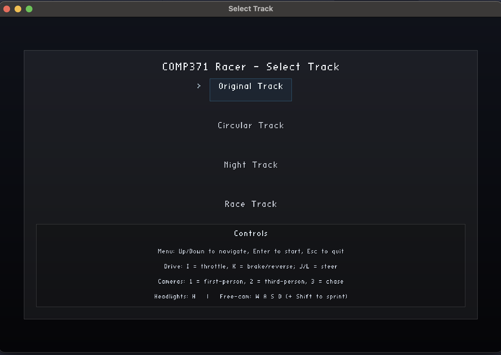

# OpenGL Race Game

A real-time 3D racing environment built using **modern OpenGL (3.3 core profile)**.  
Features a drivable car, multiple track scenes, animated environment, and dynamic lighting.

May experience lag on lower-performance computers.

---

## Features

- **Driveable Car**  
  Animated wheels with steering control  
  Physics-inspired movement (forward/reverse, steering angles)  

- **Camera System**  
  Toggle between **first-person**, **third-person**, and **chase camera**  
  Smooth transitions & adjustable speed  

- **Dynamic Lighting & Shadows**  
  - Directional sun/moon light with moving shadows  
  - Car headlights (`H` key)  
  - Lamp post lights along track  
  - Real-time shadow mapping for trees, grandstands, car, lamp poles  

- **Environment**  
  - Textured terrain with road, curbs, grass, and mountains  
  - Instanced rendering for performance (mountains, light poles, grandstands, trees)  
  - Moving clouds system  
  - Hierarchical bird animation:  
    - Bird 1 orbits central point  
    - Bird 2 orbits Bird 1 for nested motion  

- **Models & Assets**  
  - Imported with **Assimp** (.obj models)  
  - Textures loaded via **stb_image**  
  - Multiple high-quality textures for realism  

---

## Screenshots

  
  
  
  
  

---

## Running the Game

1. Compile and ensure all dependencies are installed (see [Dependencies](#dependencies)).  
2. Launch the `MainMenu` application.  
3. Select a track (**Original**, **Circular**, **Night**, or **Race Track**).  
4. The selected scene will load.

---

## Controls

| Key           | Action                                   |
|---------------|------------------------------------------|
| **W/A/S/D**   | Move camera                              |
| **Shift**     | Move camera faster                       |
| **I/K**       | Accelerate / Reverse car                 |
| **J/L**       | Steer car left/right                     |
| **H**         | Toggle car headlights                    |
| **1**         | First-person camera                      |
| **2**         | Third-person camera                      |
| **3**         | Chase camera                             |
| **ESC**       | Quit program                             |

---

## Models and Textures

**Models** (in `Models/`):  
- `Bird.obj`  
- `part.obj` (mountains)  
- `Light Pole.obj`  
- `generic medium.obj` (grandstand)  
- `tree1.obj` (trees)  

**Textures** (in `Textures/`):  
- `grass.jpg`  
- `asphalt.jpg`  
- `curb.jpg`  
- `cobblestone.jpg`  
- `mountain.jpg`  
- `car_wrap.jpg`  
- `tires.jpg`  
- `01.png`, `02.png`, `03.png` (clouds)  
- `generic medium_01_a.png`, `b.png`, `c.png` (grandstand textures)  

---

## Dependencies

- **GLEW** – OpenGL extension loader  
- **GLFW** – Windowing & input handling  
- **GLM** – Mathematics library (matrices, vectors, transforms)  
- **ASSIMP** – Model importing (.obj)  
- **stb_image** – Texture loading  

Make sure all dependencies are installed and linked before compiling.

---
